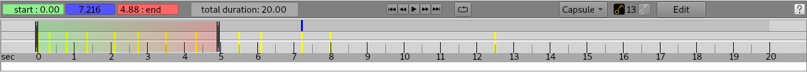
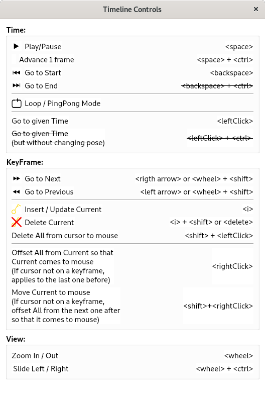

# Timeline And Keyframes

The `Ra::GuiBase::Timeline` class provides display and management of `Ra::Core::Animation::KeyFramedValue`s through
the `Ra::Core::Animation::KeyFramedValueController` class.

## The Timeline UI

The Timeline UI is a widget allowing to manipulate time and display animation keyframes:

The central part of the UI shows the time space, in which we have:
 - the time scale on the bottom part,
 - the time window drawn as a green to red sheet between movable widgets defining its start-time and end-time,
 - the current time drawn as a blue vertical line,
 - the time values, drawn as yellow vertical lines, where a keyframe is defined for the selected KeyFramedValue.

On the upper-left corner, one can define the time window for time flow, i.e.
 - define the start-time and end-time for time flow,
 - change the current time value,
 - change the maximal time display.

On the upper-middle part, one can manipulate time flow, i.e.
 - reset time to the start-time or the end-time,
 - get to the previous or next keyframe time,
 - make time flow,
 - manage the time flow policy (loop-around or forward-backward).

On the upper-right part, one can manipulate animation keyframes, i.e.
 - choose the one to display and manipulate for the selected object,
 - add a new keyframe or update the one at the current time,
 - see the current number of keyframes,
 - remove the current keyframe,
 - [coming soon] open the keyframe editor.

On the upper-far-right corner, one can open the help window, displaying shortcuts and hints on how to manipulate
the time space and the selected KeyFramedValue:



## Display animated data using the Timeline

`Ra::Core::Animation::KeyFramedValueController`s must be registered into the `Ra::GuiBase::Timeline`, which can be done using the
`Ra::GuiBase::Timeline::registerKeyFramedValue` methods, binding them to the `Ra::Engine::Entity`, `Ra::Engine::Component` or
`Ra::Engine::RenderObject` they belong to.

### Binding "Static" KeyFramedValue
Those are `Ra::Core::Animation::KeyFramedValue`s that are an explicit part of a `Ra::Engine::Entity`, `Ra::Engine::Component` or
`Ra::Engine::RenderObject` data, either filled upon construction or through the `Ra::GuiBase::Timeline`.
Static `Ra::Core::Animation::KeyFramedValue`s must be registered in the `Ra::GuiBase::Timeline` after the object's
construction.
They usually are not bound to an *UpdateCallback* function since the object they
belong to usually calls `Ra::Core::Animation::KeyFramedValue::at` to query the current value.

Example Usage:
```c++
using KeyFramedValue = Ra::Core::Animation::KeyFramedValue<Scalar>;
using KeyFramedValueController = Ra::Core::Animation::KeyFramedValueController;

struct MyComponentWithKeyFrame : public Ra::Engine::Component
{
   MyComponentWithKeyFrame( const std::string& name, Ra::Engine::Entity* entity, Scalar value = 0_ra )
       : Ra::Engine::Component( name, entity )
       , m_keyframes( value, 0_ra )
       , m_currentValue( value )
   {}

   void initialize() override {}
   void setTime( Scalar t ) {
       // Here we use the value at time t using linear interpolation between keyframes.
       m_currentValue = m_keyframes.at( t, Ra::Core::Animation::linearInterpolate<Scalar> );
       // Then update other data that may depend on that new value.
       update();
   }

  private:
   void update() {
       // Here we can update other data that depend on the value of m_currentValue.
   }

   KeyFramedValue m_keyframes;
   Scalar m_currentValue;
};

struct MyTimeDependantSystem : public Ra::Engine::System
{
   MyTimeDependantSystem( Ra::GuiBase::Timeline* timeline )
       : Ra::Engine::System()
       , m_timeline( timeline )
   {}

    void AnimationSystem::handleAssetLoading( Ra::Engine::Entity* entity, const Ra::Core::Asset::FileData* fileData ) {
        // Add a Component whenever a file is loaded
        auto comp = new MyComponentWithKeyFrame( "MyComponentWithKeyFrame_", entity );
        registerComponent( entity, comp );
        if ( m_timeline )
        {
            // on insertion we may want to get the frame value from elsewhere
            auto inserter = [comp]( const Scalar& t ) {
                // for example value(t) + 1
                comp->m_keyframes.insertKeyFrame( t, comp->m_keyframes.at( t ) + 1_ra );
            };
            // No need for an update callback since the component owns the KeyFramedValue.
            m_timeline->registerKeyFramedValue( comp, KeyFramedValueController( &comp->m_keyframes, "KeyFrame", inserter ) );
        }
    }

   void generateTasks( Ra::Core::TaskQueue* taskQueue, const Ra::Engine::FrameInfo& ) override {
       // Update all Components data.
       for ( auto compEntry : m_components )
       {
           auto comp = static_cast<MyComponentWithKeyFrame*>( compEntry.second );
           auto func = std::bind( &MyComponentWithKeyFrame::setTime, comp, frameInfo.m_animationTime );
           auto task = new Ra::Core::FunctionTask( func, "MyUpdateTask" );
           taskQueue->registerTask( task );
       }
   }

   /// The Timeline in which we record the Keyframes for visualisation and manipulation.
   Ra::GuiBase::Timeline* m_timeline{nullptr};
};
```

### Binding "Dynamic" KeyFramedValues:
Those are `Ra::Core::Animation::KeyFramedValue`s that are not part of an `Ra::Engine::Entity`, `Ra::Engine::Component` or
`Ra::Engine::RenderObject` data, but are used to keyframe some of its data.
Dynamic `Ra::Core::Animation::KeyFramedValue`s must be created for and owned by the UI, and registered in the
`Ra::GuiBase::Timeline`.
They are usually bound to an UpdateCallback function since they have to update the
object's data they are linked to.

Example Usage:
```c++
/// Let's say there is a Component class defined as:
struct MyComponent : public Component {
    MyComponent( const std::string& name, Ra::Engine::Entity* entity, Scalar value = 0_ra )
        : Ra::Engine::Component( name, entity )
        , m_currentValue( value )
    {}

    void initialize() override {}
    void update() { std::cout << m_currentValue << std::endl; }

    Scalar m_currentValue;
};

/// We here create a plugin that will keyframe the MyComponent::m_currentValue
/// attribute of selected MyComponents in the scene:

// Let's start with some simple UI:
struct MyWidget : public QWidget {
    Q_OBJECT

    MyWidget( QWigdet* parent = nulltpr ) : QWidget( parent ) {
        m_keyFrameValueCheckbox = new QCheckBox( "Keyframe current Value", this );
    }

    QCheckBox* m_keyFrameValueCheckbox;
};

// Then the plugin:
struct MyPlugin : public QObject, Ra::Plugins::RadiumPluginInterface {
    Q_OBJECT
    Q_RADIUM_PLUGIN_METADATA
    Q_INTERFACES( Ra::Plugins::RadiumPluginInterface )

    MyPlugin() = default;
    ~MyPlugin() {
        for ( auto kf : m_keyframes )
        { delete kf.second; }
    }

    void registerPlugin( const Ra::Plugins::Context& context ) override {
        // get timeline
        m_timeline = context.m_timeline;
        // connect to selection manager
        m_selectionManager = context.m_selectionManager;
        if ( m_selectionManager )
        {
            connect( m_selectionManager, &Ra::GuiBase::SelectionManager::currentChanged, this, &MyPlugin::onCurrentChanged );
        }
    }
    bool doAddWidget( QString& name ) override {
        return true;
    }
    QWidget* getWidget() override {
        m_widget = new MyWidget;
        connect( m_widget->m_keyFrameValueCheckbox, &QCheckBox::toggled, this, &MyPlugin::keyFrameValue );
        return m_widget;
    }
    bool doAddMenu() override { return false; }
    QMenu* getMenu() override { return nullptr; }
    bool doAddAction( int& nb ) override { return false; }
    QAction* getAction( int id ) override { return nullptr; }
    void onCurrentChanged( const QModelIndex& current, const QModelIndex& prev ) {
        // deal with selection
        if ( m_selectionManager->hasSelection() )
        {
            const Ra::Engine::ItemEntry& ent = m_selectionManager->currentItem();
            m_current = dynamic_cast<MyComponent*>( ent.m_component );
        }
        else
        {
            m_current = nullptr;
        }
        m_widget->m_keyFrameValueCheckbox->setChecked( m_keyframes.find( m_current ) != m_keyframes.end() );
    }
    void keyFrameValue( bool on ) {
        // deal with keyframing
        if ( m_current == nullptr ) { return; }
        if ( on )
        {
            // keyframe m_current->m_currentValue
            auto keyframes = new KeyFramedValue( m_current->m_currentValue, 0, interpolate );
            // on insertion we may want to get the frame value from elsewhere
            auto inserter = [keyframes]( const Scalar& t ) {
                // for example value(t) + 1
                keyframes->insertKeyFrame( t, keyframes->at( t ) + 1_ra );
            };
            // on update we here want to modify the value since the MyComponent cannot do it by itself
            Scalar& value = &m_current->m_currentValue;
            auto updater = [keyframes, &value]( const Scalar& t ) {
                value = keyframes->at( t );
            };
            // register the new KeyFramedValue
            m_keyframes.push_back( keyframes );
            m_timeline->registerKeyFramedValue( m_current, KeyFramedValueController( keyframes, "KeyFrame", inserter, updater ) );
        }
        else
        {
            // release m_current->m_currentValue from the keyframe
            m_timeline->unregisterKeyFramedValue( m_current, "KeyFrame" );
        }
    };

    MyWidget* m_widget{nullptr};
    Ra::GuiBase::Timeline* m_timeline{nullptr};
    MyComponent* m_current;
    std::map<MyComponent*,KeyFramedValue*> m_keyframes;
};
```
