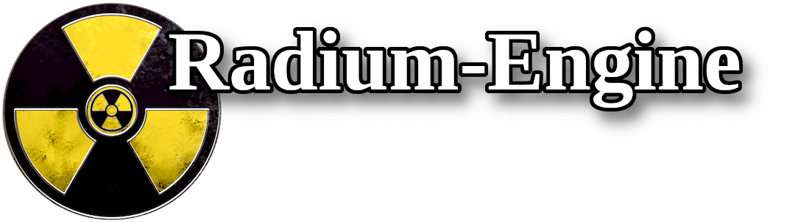

\mainpage

Radium is a research 3D Engine for rendering, animation and processing.
Developed and maintained by the [STORM research group](https://www.irit.fr/STORM/site/).

The source code is hosted on github: <https://github.com/STORM-IRIT/Radium-Engine>

### Overview

See [this presentation](https://docs.google.com/presentation/d/12W2KXY7ctJXFIelmgNEn7obiBv_E4bmcMl3mXeJPVgc/edit?usp=sharing) for an overview of the project.

The documentation is structured as follow:

- \ref basicsmanual : how to compile Radium and use it in your own project.
- \ref develmanual : general topics (e.g. coding conventions) and description of the concepts found in the API of Radium.
- \ref conceptsmanual : high level concepts used in Radium Engine

### Badges

[/graph/badge.svg?token=MKfANkC3sd)](https://codecov.io/gh/STORM-IRIT/Radium-Engine)

[.windows-latest.Release.float.json)](https://github.com/STORM-IRIT/Radium-Engine/actions?query=branch%3A$(GITHUB_REF)+workflow%3A%22*CI%22)
[.windows-latest.Debug.float.json)](https://github.com/STORM-IRIT/Radium-Engine/actions?query=branch%3A$(GITHUB_REF)+workflow%3A%22*CI%22)
[.windows-latest.Release.double.json)](https://github.com/STORM-IRIT/Radium-Engine/actions?query=branch%3A$(GITHUB_REF)+workflow%3A%22*CI%22)
[.windows-latest.Debug.double.json)](https://github.com/STORM-IRIT/Radium-Engine/actions?query=branch%3A$(GITHUB_REF)+workflow%3A%22*CI%22)

[.macos-latest.Release.float.json)](https://github.com/STORM-IRIT/Radium-Engine/actions?query=branch%3A$(GITHUB_REF)+workflow%3A%22*CI%22)
[.macos-latest.Debug.float.json)](https://github.com/STORM-IRIT/Radium-Engine/actions?query=branch%3A$(GITHUB_REF)+workflow%3A%22*CI%22)
[.macos-latest.Release.double.json)](https://github.com/STORM-IRIT/Radium-Engine/actions?query=branch%3A$(GITHUB_REF)+workflow%3A%22*CI%22)
[.macos-latest.Debug.double.json)](https://github.com/STORM-IRIT/Radium-Engine/actions?query=branch%3A$(GITHUB_REF)+workflow%3A%22*CI%22)

[.ubuntu-latest.Release.float.json)](https://github.com/STORM-IRIT/Radium-Engine/actions?query=branch%3A$(GITHUB_REF)+workflow%3A%22*CI%22)
[.ubuntu-latest.Debug.float.json)](https://github.com/STORM-IRIT/Radium-Engine/actions?query=branch%3A$(GITHUB_REF)+workflow%3A%22*CI%22)
[.ubuntu-latest.Release.double.json)](https://github.com/STORM-IRIT/Radium-Engine/actions?query=branch%3A$(GITHUB_REF)+workflow%3A%22*CI%22)
[.ubuntu-latest.Debug.double.json)](https://github.com/STORM-IRIT/Radium-Engine/actions?query=branch%3A$(GITHUB_REF)+workflow%3A%22*CI%22)
